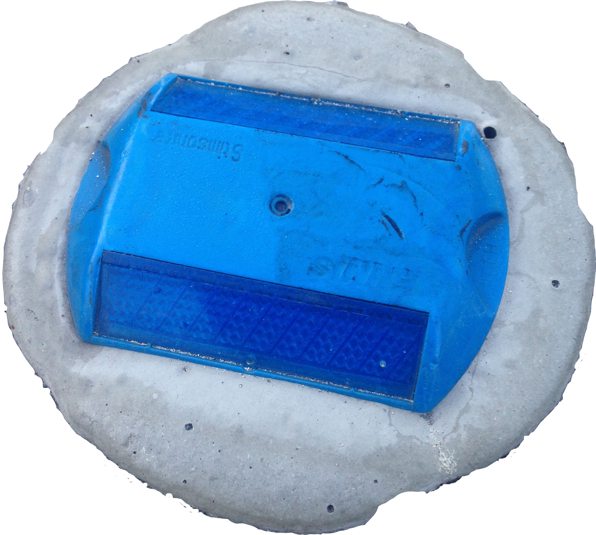

#  Reflector
---
[](https://travis-ci.org/zabawaba99/reflector)
[](https://coveralls.io/r/zabawaba99/reflector?branch=master)
[](https://maven-badges.herokuapp.com/maven-central/com.github.zabawaba99/reflector)

---

Making reflective programming simpler.

##### Under Development
The API may or may not change radically within the next upcoming weeks. 

## Usage

### With Maven

Add the snapshot repository and the dependency to you pom.xml file

```xml
<repositories>
	<repository>
		<id>sonatype-snapshot</id>
		<url>https://oss.sonatype.org/content/groups/public</url>
		<snapshots>
			<enabled>true</enabled>
		</snapshots>
	</repository>
</repositories>

<dependencies>
	<dependency>
		<groupId>com.zabawaba99</groupId>
		<artifactId>reflector</artifactId>
		<version>0.2.0-SNAPSHOT</version>
	</dependency>
</dependencies>
```

### Gradle

```xml
compile 'com.github.zabawaba99:reflector:0.2.0'
```


### Manual install

You can go to the [sonatype repository](https://oss.sonatype.org/content/groups/public/com/github/zabawaba99/reflector/) and download the version of reflector that you're interested in using.

---

After adding Reflector to your project, just import the package
and start using.

```java
package com.example

import com.zabawaba.reflector;

public static void main(String[] args){
	SomeObject obj = new SomeObject();
	Object fieldValue = Fields.forObj(obj).get("foo").getValue();
	// ... do something with the field's value
}
```

## Contributing

1. Fork it
2. Create your feature branch (`git checkout -b new-feature`)
3. Commit your changes (`git commit -am 'Some cool reflection'`)
4. Push to the branch (`git push origin new-feature`)
5. Create new Pull Request
